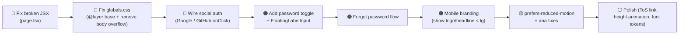

# Design Review Results: /auth

**Review Date**: 2026-04-26
**Route**: `/auth` → `src/app/auth/page.tsx`
**Focus Areas**: All — Visual Design, UX/Usability, Responsive/Mobile, Accessibility, Micro-interactions/Motion, Consistency, Performance
**Inspiration**: Facebook / Meta auth page

> **Note**: This review was conducted through static code analysis only (dev server was unreachable during review). Visual inspection via browser would provide additional insights into layout rendering, interactive behaviors, and actual appearance.

---

## Summary

The `/auth` page has a visually polished dark split-screen design with good animation foundations, but contains a **critical broken JSX structure** that would prevent compilation, a **Tailwind v4 cascade violation** in `globals.css`, and several missing accessibility and usability patterns (no password toggle, dead social auth buttons, no forgot-password handler, unused `FloatingLabelInput` component). The marketing split panel is also hidden on mobile, leaving the form side under-branded.

---

## Issues

| # | Issue | Criticality | Category | Location |
|---|-------|-------------|----------|----------|
| 1 | **Broken JSX structure**: GitHub `<svg>` and `<button>` tags are never closed (line 210 has `
` instead of `</svg></button>`); the RIGHT form panel JSX is duplicated (appears twice, lines 128–218 and 220–336); the root `
` is never closed. This causes a TypeScript compile error. | 🔴 Critical | Consistency | `src/app/auth/page.tsx:210-337` |
| 2 | **Tailwind v4 cascade violation**: The global `*` reset (box-sizing) and `body` styles in `globals.css` are unlayered — they will silently override all Tailwind utilities for margin, padding, and layout across the entire app. Must be wrapped in `@layer base {}`. | 🔴 Critical | Performance | `src/app/globals.css:8-17` |
| 3 | **Global `body { overflow: hidden }` blocks scrolling app-wide**: Any non-auth page that needs to scroll is broken from the start. The auth page already applies `overflow:hidden` via a `useEffect`, so the global rule is redundant and harmful. | 🔴 Critical | UX/Usability | `src/app/globals.css:16`, `src/app/auth/page.tsx:13-24` |
| 4 | **Social auth buttons (Google/GitHub) are non-functional**: Both `<button>` elements have no `onClick` handler. Users clicking them get zero feedback — no action, no error. `better-auth` provides `authClient.signIn.social()` which should be wired up. | 🔴 Critical | UX/Usability | `src/app/auth/page.tsx:190-215` |
| 5 | **"Forgot password" button is a dead stub**: `<button type="button">Forgot?</button>` has no handler. This is a table-stakes auth feature — users with forgotten passwords have no recovery path. | 🟠 High | UX/Usability | `src/components/SignInForm.tsx:58-60` |
| 6 | **`FloatingLabelInput` component exists but is unused**: A well-built floating-label input with focus states and violet ring is available at `src/components/ui/floating-label-input.tsx` but both `SignInForm` and `SignUpForm` use raw `<input className="input-dark">` instead. The existing component is more accessible and consistent. | 🟠 High | Consistency | `src/components/SignInForm.tsx:40-49`, `src/components/SignUpForm.tsx:45-55`, `src/components/ui/floating-label-input.tsx` |
| 7 | **No password visibility toggle**: Both sign-in and sign-up password fields use `type="password"` with no show/hide toggle. Users cannot verify what they typed, leading to failed login attempts and frustration. Minimum touch target for the toggle icon is 44×44px (WCAG 2.5.5). | 🟠 High | UX/Usability + Accessibility | `src/components/SignInForm.tsx:62-74`, `src/components/SignUpForm.tsx:76-89` |
| 8 | **No password strength feedback in Sign Up**: `SignUpForm` only enforces `minLength={6}` but gives users no real-time signal about password quality. Weak passwords are silently accepted. | 🟠 High | UX/Usability | `src/components/SignUpForm.tsx:76-91` |
| 9 | **Left visual panel is entirely hidden on mobile (`hidden lg:flex`)**: On screens < 1024px the branding, headline, and social proof completely disappear. The right form panel shows the `lg:hidden` logo only, leaving users without context about the product. | 🟠 High | Responsive/Mobile | `src/app/auth/page.tsx:33` |
| 10 | **`btn-gradient::before` hover overlay hides button text**: The hover pseudo-element fills the entire button with `opacity:0 → 1` but the `` child text has no `position:relative; z-index:1`, so the overlay can render on top of the label in some browsers. | 🟠 High | Visual Design + Micro-interactions | `src/app/globals.css:122-138` |
| 11 | **No `focus-visible` outline on `<input>` elements**: `button:focus-visible` has a `2px solid #8b5cf6` outline, but inputs rely solely on a `box-shadow` for focus indication. Box shadows can be suppressed by OS high-contrast modes — `outline` is required for WCAG 2.4.7 compliance. | 🟠 High | Accessibility | `src/app/globals.css:94-111` |
| 12 | **Avatar initials elements have no accessible labels**: The stacked avatar `<motion.div>` bubbles rendering "JD", "AS", etc. are decorative text — they carry no `aria-label` or `aria-hidden` attribute, creating confusing screen reader output ("JD AS MK RL TW"). | 🟡 Medium | Accessibility | `src/app/auth/page.tsx:108-119` |
| 13 | **Metadata title typo — "Hackaton" instead of "Hackathon"**: The `<title>` is set globally in `layout.tsx` as `"Hackaton \| Auth"`. This appears in the browser tab, search results, and screen reader announcements. | 🟡 Medium | Consistency | `src/app/layout.tsx:20` |
| 14 | **Inline `style={{ fontFamily: 'var(--font-outfit)' }}` repeated 8+ times**: Font family is applied via inline styles on individual elements instead of using Tailwind's `font-display` / `font-body` utilities from the `@theme` definition. This makes font refactoring brittle. | 🟡 Medium | Consistency + Performance | `src/app/auth/page.tsx:87,96,120,153,157,183,202,212` |
| 15 | **Glass card height jump when toggling Sign In ↔ Sign Up**: `AnimatePresence` animates opacity/x but the glass card container has no fixed or animated `min-height`. Switching from Sign In (2 fields) to Sign Up (3 fields) causes a layout jump without height transition. | 🟡 Medium | Micro-interactions/Motion | `src/app/auth/page.tsx:163-178` |
| 16 | **`FloatingLabel` background is hardcoded `bg-zinc-950`**: The floating label uses `bg-zinc-950` for its background strip, but the actual page background is `#09090b` (a custom value, not exactly `zinc-950` = `#09090b` — they match, but this creates an invisible coupling that breaks if the background changes). | 🟡 Medium | Consistency | `src/components/ui/floating-label-input.tsx:31` |
| 17 | **"Terms of Service" is plain text, not a link**: The ToS notice at the bottom of the form (`src/app/auth/page.tsx:330`) is a `
` with no anchor or link. Users cannot navigate to the terms. | 🟡 Medium | UX/Usability | `src/app/auth/page.tsx:330-332` |
| 18 | **`reduce-motion` not respected for Framer Motion animations**: The rotating/scaling blob animations and staggered avatar entrance use `Infinity` repeat transitions. Users with `prefers-reduced-motion` enabled will still see constant motion, which can trigger vestibular disorders. Framer Motion supports `useReducedMotion()` hook. | 🟡 Medium | Accessibility | `src/app/auth/page.tsx:37-72`, `src/app/auth/page.tsx:109-118` |
| 19 | **No "Remember me" option in Sign In**: Standard auth UX expectation — absence forces users to re-authenticate on every session (depending on better-auth session config). | ⚪ Low | UX/Usability | `src/components/SignInForm.tsx` |
| 20 | **Left panel content uses `justify-between` with large empty center gap**: Logo anchored to top, marketing copy anchored to bottom — the center of the 55%-wide panel is empty. On tall screens this gap becomes very large and the layout looks unbalanced. | ⚪ Low | Visual Design | `src/app/auth/page.tsx:80` |
| 21 | **`rotate: 360` animation with `ease: "linear"` causes jank on low-end devices**: Three simultaneous `Infinity` animations running on `motion.div` elements with blur filters are GPU-intensive. Consider `will-change: transform` or reducing to one animated element. | ⚪ Low | Performance | `src/app/auth/page.tsx:37-73` |

---

## Criticality Legend

- 🔴 **Critical**: Breaks functionality, blocks compilation, or violates accessibility standards
- 🟠 **High**: Significantly impacts user experience or design quality
- 🟡 **Medium**: Noticeable issue that should be addressed
- ⚪ **Low**: Nice-to-have improvement

---

## Next Steps

**Suggested priority order:**

| Priority | Issues | Effort |
|----------|--------|--------|
| Immediate (blocks compile) | #1 Broken JSX | Low — fix tag structure |
| This sprint | #2 #3 globals.css, #4 social auth, #5 forgot password, #6 FloatingLabelInput, #7 password toggle, #8 strength indicator, #9 mobile branding | Medium |
| Next sprint | #10–#18 Accessibility, motion, consistency | Medium |
| Backlog | #19–#21 UX polish | Low |
